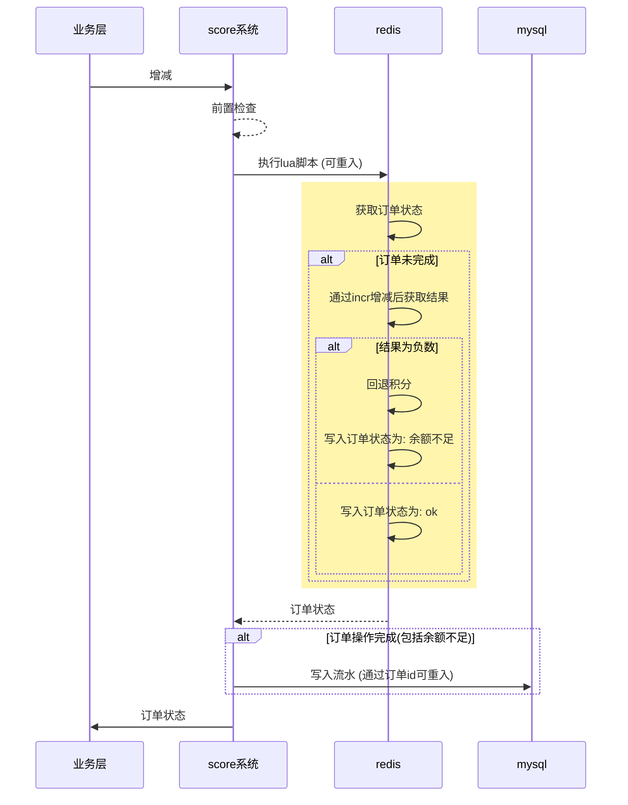
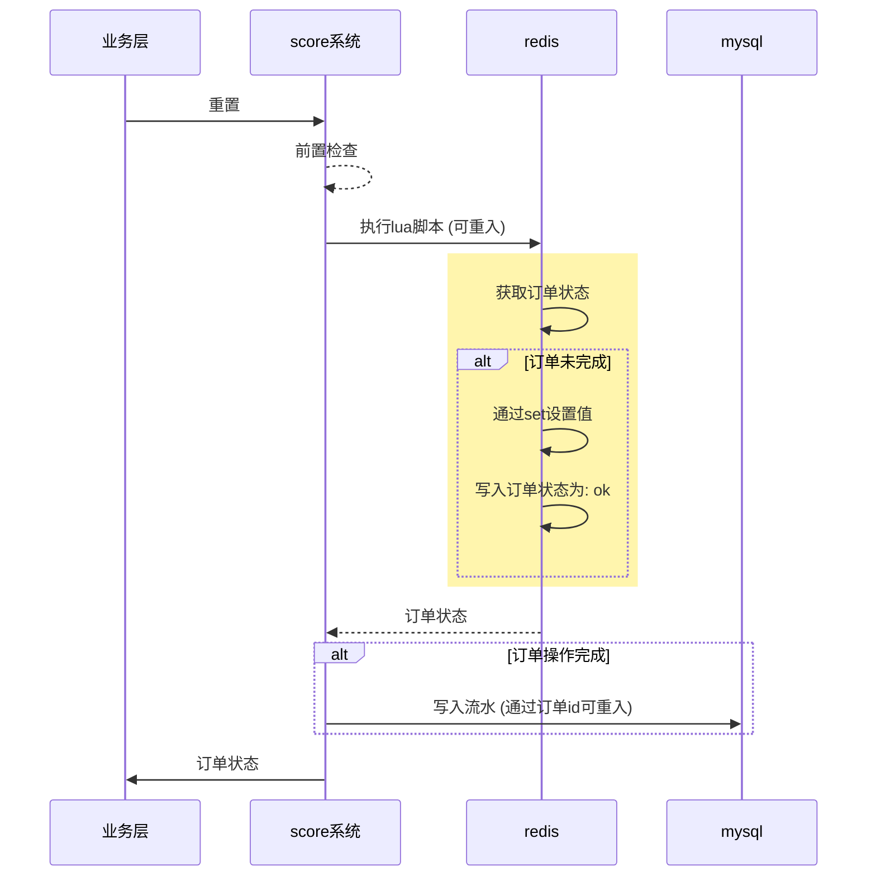

<!-- TOC -->

- [什么是 score](#%E4%BB%80%E4%B9%88%E6%98%AF-score)
- [前置准备](#%E5%89%8D%E7%BD%AE%E5%87%86%E5%A4%87)
    - [底层组件要求](#%E5%BA%95%E5%B1%82%E7%BB%84%E4%BB%B6%E8%A6%81%E6%B1%82)
    - [sql文件导入可选](#sql%E6%96%87%E4%BB%B6%E5%AF%BC%E5%85%A5%E5%8F%AF%E9%80%89)
    - [调整积分key格式化字符串](#%E8%B0%83%E6%95%B4%E7%A7%AF%E5%88%86key%E6%A0%BC%E5%BC%8F%E5%8C%96%E5%AD%97%E7%AC%A6%E4%B8%B2)
    - [注册积分类型](#%E6%B3%A8%E5%86%8C%E7%A7%AF%E5%88%86%E7%B1%BB%E5%9E%8B)
    - [修改配置文件](#%E4%BF%AE%E6%94%B9%E9%85%8D%E7%BD%AE%E6%96%87%E4%BB%B6)
- [示例](#%E7%A4%BA%E4%BE%8B)
- [底层设计](#%E5%BA%95%E5%B1%82%E8%AE%BE%E8%AE%A1)
    - [积分类型](#%E7%A7%AF%E5%88%86%E7%B1%BB%E5%9E%8B)
    - [域](#%E5%9F%9F)
    - [订单号](#%E8%AE%A2%E5%8D%95%E5%8F%B7)
    - [流水记录](#%E6%B5%81%E6%B0%B4%E8%AE%B0%E5%BD%95)
    - [积分数据](#%E7%A7%AF%E5%88%86%E6%95%B0%E6%8D%AE)
    - [写积分流程](#%E5%86%99%E7%A7%AF%E5%88%86%E6%B5%81%E7%A8%8B)
        - [增加/扣除积分](#%E5%A2%9E%E5%8A%A0%E6%89%A3%E9%99%A4%E7%A7%AF%E5%88%86)
        - [重置积分](#%E9%87%8D%E7%BD%AE%E7%A7%AF%E5%88%86)
- [注意事项](#%E6%B3%A8%E6%84%8F%E4%BA%8B%E9%A1%B9)
    - [余额不足后充值再次扣除还是显示余额不足](#%E4%BD%99%E9%A2%9D%E4%B8%8D%E8%B6%B3%E5%90%8E%E5%85%85%E5%80%BC%E5%86%8D%E6%AC%A1%E6%89%A3%E9%99%A4%E8%BF%98%E6%98%AF%E6%98%BE%E7%A4%BA%E4%BD%99%E9%A2%9D%E4%B8%8D%E8%B6%B3)

<!-- /TOC -->

---

# 什么是 score

score 是一个积分系统, 可用于会员积分/系统内货币等.
这个库是实现积分系统的lib库, 多个不同业务/分布式系统也能直接引用这个lib库且可以使用相同的底层储存组件(redis/mysql), 其业务隔离性由积分类型来区分.

- [x] 多积分类型
- [x] 同积分类型支持多域
- [x] 积分生效/失效时间(允许操作开始结束时间)
- [ ] ~~积分过期后自动删除数据(redis数据自动过期或自动删除)~~ (后续也不考虑支持, 参考 [积分数据](#积分数据) 说明)


- [x] 余额查询
- [x] 增加积分
- [x] 扣除积分
- [x] 重置积分
- [x] 获取订单状态
- [ ] 同用户不同积分类型兑换. 暂不支持, 可以通过 [order](https://github.com/zlyuancn/order) 配合实现
- [ ] 不同用户同积分类型转账. 暂不支持, 可以通过 [order](https://github.com/zlyuancn/order) 配合实现
- [ ] ~~自定义订单id (用于支持特色业务, 比如领取积分防重发)~~ 业务可以自行生成业务的订单id映射为积分系统的订单id来实现, 这可能需要额外存储其映射关系.


- [x] 强校验参数(操作类型/操作数值/积分类型/域/uid)
- [x] 流水记录
- [ ] ~~流水记录自动删除~~ (后续也不考虑支持, 参考 [流水记录](#流水记录) 说明)


- [x] 并发支持
- [x] 操作可重入


- [x] metrics上报(已通过[filter](https://github.com/zly-app/zapp/tree/master/filter)实现)

---

# 前置准备

## 底层组件要求

- redis 储存积分类型/积分数据/订单状态, 也可以使用 [kvrocks](https://kvrocks.apache.org/) (兼容redis的硬盘存储nosql)
- mysql(可选) 储存积分类型/积分流水, 可以使用 mysql/mariadb/pgsql 等

## sql文件导入(可选)

1. 首先准备一个库名为 `score` 的mysql库. 这个库名可以根据sqlx组件配置的连接db库修改
2. 创建积分类型表, 积分类型的表文件在[这里](./db_table/score_type.sql). 如果配置从redis加载可以不用操作这一步.
3. 创建积分流水的分表, 默认为2个分表, 分表索引从0开始. 一开始应该设计好分表数量, 确认好后不支持修改分表数量, 如果你不知道设置为多少就设为1000. 注意, 配置文件中key`ScoreFlowTableShardNums`必须与这里设置的分片数量相同.
   1. 构建分表的工具为 [stf](https://github.com/zlyuancn/stt/tree/master/stf)
   2. 积分流水的分表文件在[这里](./db_table/score_flow_.sql)
   3. 在[这里](./db_table/score_flow_.out.sql)可以看到已经生成好了2个分表的sql文件, 可以直接导入.

## 调整积分key格式化字符串

如果你使用了分布式redis系统, 请根据你使用的分布式redis系统的hashtag来调整key算法以将同一个用户id的数据分配到同一个分片中, 否则导致功能异常. 由于底层对同用户的操作均采用lua脚本, 要求操作的多个key必须在同一个节点.

| 描述         | 配置key                | 默认key格式化字符串                                | 数据类型 | 有效期       | 支持替换的字符                            |
| ------------ | ---------------------- | -------------------------------------------------- | -------- | ------------ | ----------------------------------------- |
| 积分数据     | ScoreDataKeyFormat     | score:\<score_type_id\>:\<domain\>:{\<uid\>}       | string   | 永久         | `<uid>`/`<domain>`/`<score_type_id>`      |
| 订单状态     | OrderStatusKeyFormat   | score_os:\<order_id\>:{\<uid\>}                    | string   | 30天(可配置) | `<uid>`/`<order_id>`                      |
| 订单号生成器 | GenOrderSeqNoKeyFormat | score_sn:\<score_type_id\>:\<score_type_id_shard\> | string   | 永久         | `<score_type_id>`/`<score_type_id_shard>` |

其中订单状态key中加上`{<uid>}`的原因是在分布式redis系统中lua脚本要操作的这些key(积分数据/订单状态等)都要在同一个节点中, 而用户id的区分度较大, 能方便分散到不同节点避免单节点负载过高.

key中的字符替换说明如下

| 字符                    | 说明           |
| ----------------------- | -------------- |
| \<uid\>                 | 用户唯一id     |
| \<domain\>              | 域             |
| \<score_type_id\>       | 积分类型id     |
| \<order_id\>            | 订单id         |
| \<score_type_id_shard\> | 积分类型id分片 |

## 注册积分类型

积分类型只有注册之后才会使用, 这是为了防止多业务的积分类型冲突. 注册积分类型后大约1分钟生效(常驻内存每隔1分钟刷新以实现高性能).

如果配置文件key`ScoreTypeSqlxName`指定了sqlx组件名, 需要将积分类型加入到mysql的`score_type`表.

如果配置文件key`ScoreTypeRedisName`指定了在redis组件名, 则需要在配置文件key`ScoreTypeRedisKey`指定的 redis hash map 中增加数据, 其 field 为积分类型(正整数), 值为以下结构
```json
{
    "score_name": "积分名", // 积分名, 与代码无关, 用于告诉配置人员这个积分类型是什么业务
    "start_time": 1723017306, // 生效时间, 秒级时间戳, 0 表示不限制
    "end_time": 1723017306, // 失效时间, 秒级时间戳, 0 表示不限制
    "order_status_expire_day": 30, // 订单状态保留多少天
    "verify_order_create_less_than": 7, // 操作时验证订单id创建时间小于多少天, 不要超过积分状态储存时间, 否则可能导致在重入时由于查不到积分状态重新操作了用户积分
    "remark": "备注"
}
```

## 修改配置文件

配置内容参考:

```yaml
# score配置
score:
  ScoreRedisName: "score" # 积分数据redis组件名
  ScoreDataKeyFormat: "score:<score_type_id>:<domain>:{<uid>}" # 积分数据key格式化字符串
  TryEvalShaScoreOP: true # 尝试通过 redis EVALSHA 命令操作积分
  OrderStatusKeyFormat: "score_os:<order_id>:{<uid>}" # 订单状态key格式化字符串
  GenOrderSeqNoKeyFormat: "score_sn:<score_type_id>:<score_type_id_shard>" # 订单号生成器key格式化字符串
  GenOrderSeqNoKeyShardNum: 1000 # 生成订单序列号key的分片数

  ScoreTypeRedisName: "score" # 积分类型redis组件名
  ScoreTypeRedisKey: "score:score_type" # 积分类型从redis加载的 hash map key名
  ScoreTypeSqlxName: "" # 积分类型sqlx组件名, 如果配置了 ScoreTypeRedisName 则仅从redis加载积分类型
  ReloadScoreTypeIntervalSec: 60 # 重新加载积分类型间隔秒数

  ScoreFlowSqlxName: "score" # 积分流水记录sqlx组件名
  WriteScoreFlow: false # 是否写入积分流水
  ScoreFlowTableShardNums: 2 # 积分流水记录表分片数量

# 依赖组件
components:
  sqlx: # 参考 https://github.com/zly-app/component/tree/master/sqlx
    score:
      # ...
  redis: # 参考 https://github.com/zly-app/component/tree/master/redis
    score:
      # ...
```

---

# 示例

```go
app := zapp.NewApp("zapp.test.score",
    score.WithService(),
)
defer app.Exit()

const (
  scoreTypeID = 1
  domain      = "test_domain"
  uid         = "test_uid"
)
sdk := score.NewSdk(scoreTypeID, domain, uid)

// 生成订单id
orderID, _ := sdk.GenOrderSeqNo(ctx)

// 增加score
addOrderData, _ := sdk.AddScore(ctx, orderID, 100, "add score")
// 扣除score
deductOrderData, _ := sdk.DeductScore(ctx, orderID, 30, "deduct score")
// 获取score
score, _ := sdk.GetScore(ctx)
// 重设score
resetOrderData, _ := sdk.ResetScore(ctx, orderID, 66, "reset score")
// 获取订单状态
orderData, orderStatus, _ := sdk.GetOrderStatus(ctx, orderID)
```

---

# 底层设计

## 积分类型

不同的业务可能会使用完全隔离的积分, 比如用户在商城系统有一个商城货币, 在会员系统有个会员积分, 在bbs系统还有个签到积分等等, 这些隔离计算的积分就是不同的积分类型.

## 域

相同积分类型也可能在不同的状态下采用不同的域, 比如签到积分每一年分开计算, 其积分类型相同, 而域就是以年为变量计算出来的.

域不需要注册, 它是由具体业务控制的, 如果你的业务不需要支持域, 在调用积分系统时对代码的域变量传入空字符串即可.

## 订单号

对用户的积分写操作都需要一个订单号来承载这个操作, 订单号是一个全局不重复的字符串, 其生成方式为使用一个key(`score_sn:<积分类型id>`)调用`incr`命令加1, 订单号为`<时间戳>_<incr结果值>_<crc32(uid)>_<积分类型id>_<域>`, 由于将`积分类型id`也写入到了订单号中, 保证了全局不会重复.

当然这样就造成了热key, 所以需要对这个key进行分片, 比如分1000片, 其key为`score_sn:<积分类型id>:<分片号>`. 这里对分片的选择没有要求, 可以直接随机或者轮询.

而由于加了分片key, 不同分片`incr`后的值会有重复, 所以订单号需要带上分片号, 如`<时间戳>_<分片号>_<incr结果值>_<crc32(uid)>_<积分类型id>_<域>`. 

## 流水记录

流水记录数据存放在n个分表中, 同一个用户的流水会存放在同一个分表.

score系统不会删除历史流水记录, 如果有这个需求, 需要业务层自行删除. 对于一般业务来说流水数据是重要的资产, 如果真的是储存满了且不想扩容, 可以写脚本删除历史数据, 没必要做定时删除任务.

流水的写入可能会失败, 可以通过 `score_flow.InjectScoreFlowMq` 接入mq后置补偿, 要求mq必须延迟消费. 当mq消费时调用`score_flow.TriggerMqSignalCallback`触发后置补偿.

## 积分数据

积分数据存放在 `redis`的`string`类型中, 每个用户在每个积分类型的每一个域下都有一个key, 其value为积分的值.

参考[调整积分key格式化字符串](#调整积分key格式化字符串)

score系统不会在积分类型到期后删除用户的积分数据, 如果有这个需求, 需要业务层自行删除, 对于一般业务来说积分数据是重要的资产, 如果真的是储存满了且不想扩容, 可以写脚本删除历史数据, 没必要做定时删除任务.

## 写积分流程

注: 以下图中黄色块为lua脚本

### 增加/扣除积分



### 重置积分



---

# 注意事项

## 余额不足后充值再次扣除还是显示余额不足

这里是进行了三次交易, 如下场景中, 假设用户当前有 50 积分

1. 使用订单号 a 发起扣除积分 100, 但是显示余额不足
2. 使用订单号 b 发起增加积分 200, 显示增加成功, 此时用户还有 250 积分
3. 再次使用订单号 a 发起扣除积分 100, 仍然显示余额不足

这是因为, 在第一次交易中, 该单号已经完成了, 状态为余额不足, 一个已完成的订单重试时不会做任何操作而是直接返回第一次操作的结果. 也就是说相同的订单号无论操作多少次其结果是不变的.

这里的解决办法是应该重新创建一个订单来扣除积分.


