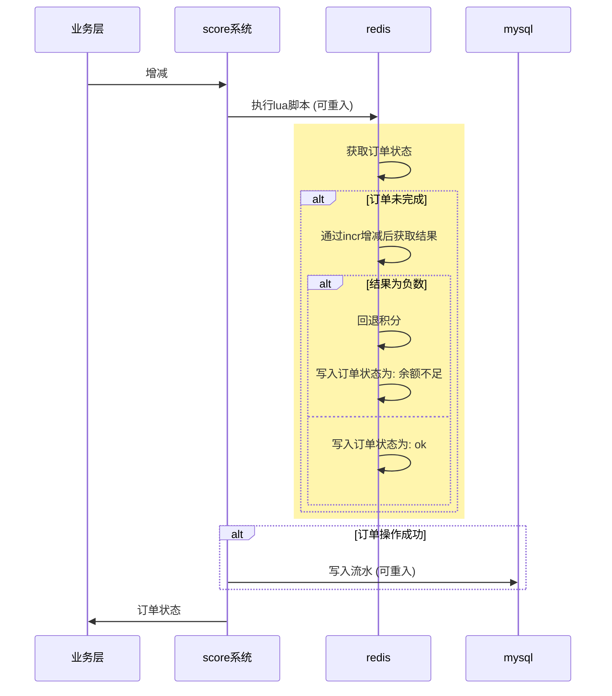
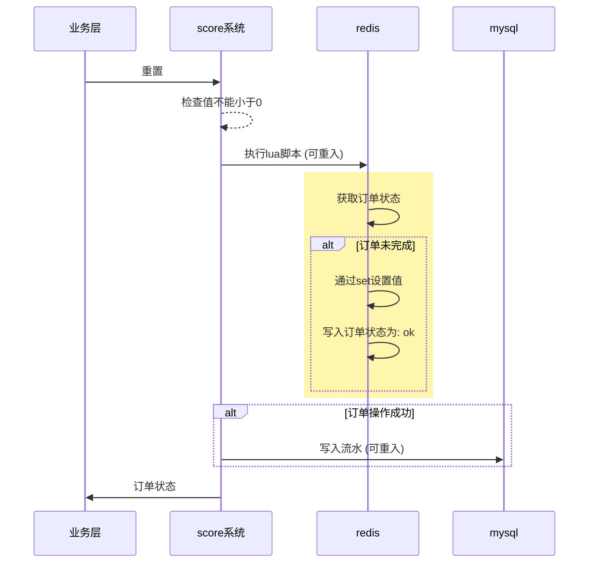

<!-- TOC -->

- [什么是 score](#%E4%BB%80%E4%B9%88%E6%98%AF-score)
- [前置准备](#%E5%89%8D%E7%BD%AE%E5%87%86%E5%A4%87)
    - [底层组件要求](#%E5%BA%95%E5%B1%82%E7%BB%84%E4%BB%B6%E8%A6%81%E6%B1%82)
    - [sql文件导入](#sql%E6%96%87%E4%BB%B6%E5%AF%BC%E5%85%A5)
    - [调整积分key算法](#%E8%B0%83%E6%95%B4%E7%A7%AF%E5%88%86key%E7%AE%97%E6%B3%95)
    - [注册积分类型](#%E6%B3%A8%E5%86%8C%E7%A7%AF%E5%88%86%E7%B1%BB%E5%9E%8B)
- [底层设计](#%E5%BA%95%E5%B1%82%E8%AE%BE%E8%AE%A1)
    - [积分类型/域](#%E7%A7%AF%E5%88%86%E7%B1%BB%E5%9E%8B%E5%9F%9F)
    - [订单号](#%E8%AE%A2%E5%8D%95%E5%8F%B7)
    - [流水记录](#%E6%B5%81%E6%B0%B4%E8%AE%B0%E5%BD%95)
    - [积分数据](#%E7%A7%AF%E5%88%86%E6%95%B0%E6%8D%AE)
    - [写积分流程](#%E5%86%99%E7%A7%AF%E5%88%86%E6%B5%81%E7%A8%8B)
        - [增加/扣除积分](#%E5%A2%9E%E5%8A%A0%E6%89%A3%E9%99%A4%E7%A7%AF%E5%88%86)
        - [重置积分](#%E9%87%8D%E7%BD%AE%E7%A7%AF%E5%88%86)

<!-- /TOC -->

---

# 什么是 score

score 是一个积分系统, 可用于会员积分/系统内货币等.
这个库是实现积分系统的lib库, 多个不同业务/分布式系统也能直接引用这个lib库且可以使用相同的底层储存组件(redis/mysql), 其业务隔离性由积分类型来区分.

- [x] 多积分类型
- [x] 同积分类型支持多域
- [ ] 积分生效时间和自动过期
 
- [x] 余额查询
- [x] 增加积分
- [x] 扣除积分
- [x] 重置积分
- [ ] 同用户不同积分类型兑换
- [ ] 不同用户同积分类型转账
 
- [x] 流水记录
- [ ] 流水记录自动删除. (后续也不考虑支持, 参考 [流水记录](#流水记录) 说明)
 
- [x] 并发支持
- [x] 操作可重入
 
- [ ] metrics上报

---

# 前置准备

## 底层组件要求

- redis 储存积分数据/订单状态, 也可以使用 kvrocks (兼容redis的硬盘储存nosql)
- mysql 储存积分类型/操作流水, 可以使用 mysql/mariadb/pgsql 等

## sql文件导入

1. 首先准备一个库名为 `score` 的mysql库. 这个库名可以根据sqlx组件配置的连接db库修改
2. 创建积分类型表, 积分类型的表文件在[这里](https://github.com/zlyuancn/score/tree/master/db_table/score_type.sql)
3. 创建积分流水的分表, 默认为2个分表, 分表索引从0开始, 可以通过配置`TableShardNums`修改. 一开始应该设计好分表数量, 确认好后暂不支持修改分表数量, 如果你不知道设置为多少就设为1000.
   1. 构建分表的工具为 [stf](https://github.com/zlyuancn/stt/tree/master/stf)
   2. 积分流水的分表文件在[这里](https://github.com/zlyuancn/score/tree/master/db_table/score_flow_.sql)
   3. 在[这里](https://github.com/zlyuancn/score/tree/master/db_table/score_flow_.out.sql)可以看到已经生成好了2个分表的sql文件, 可以直接导入.

## 调整积分key算法

如果你使用了分布式redis系统, 请根据你使用的分布式redis系统的hashtag来调整key算法将同一个用户id的数据分配到同一个分片中, 否则导致功能异常. 底层对同用户的操作均采用lua脚本, 当操作的多个key在不同的节点会导致脚本异常.

具体key算法可以修改配置文件的`GenKeyFormat`配置, 其字符替换说明如下

| 字符           | 替换说明   |
| -------------- | ---------- |
| \<uid\>        | 用户唯一id |
| \<domain\>     | 域         |
| \<score_type\> | 积分类型   |

## 注册积分类型

积分类型只有注册之后才会使用, 这是为了防止多业务的积分类型冲突, 将积分类型加入到mysql的`score_type`表后大约1分钟生效(常驻内存每隔1分钟刷新以实现高性能).

---

# 底层设计

## 积分类型/域

不同的业务可能会使用完全隔离的积分, 比如用户在商城系统有一个商城货币, 在会员系统有个会员积分, 在bbs系统还有个签到积分等等, 这些隔离计算的积分就是不同的积分类型.

同积分类型也可能在不同的时间采用不同的域, 比如签到积分每隔一年自动清空, 其积分类型相同, 而域就是以年为变量计算出来的.

注意! 由于此模块是lib库, 多业务中不要将积分类型冲突了.

## 订单号

对用户的积分写操作都需要一个订单号来承载这个操作, 订单号是一个全局不重复的字符串, 其生成方式为使用一个key(`<积分id>:score_sn`)调用`incr`命令加1, 其结果保证不会重复, 订单号为`<incr结果值>`

当然这样就造成了热key, 所以需要对这个key进行分片, 比如分1000片, 其key为`<积分id>:<分片号>:score_sn`. 这里对分片的选择没有要求, 可以直接随机或者轮询.

而由于加了分片key, 不同分片`incr`后的值会有重复, 所以订单号需要带上分片号, 如`<incr结果值>:<分片号>`. 

## 流水记录

流水记录数据存放在n个分表中, 同一个用户的流水会存放在同一个分表.

score系统不会删除历史流水记录, 如果有这个需求, 需要业务层自行删除. 对于一般业务来说流水数据是重要的资产, 如果真的是储存满了且不想扩容, 可以写脚本删除历史数据, 没必要做定时删除任务.

## 积分数据

积分数据存放在 `redis`的`string`类型中, 每个用户在每个积分类型的每一个域下都有一个key, 其value为积分的值.

默认key算法为 `{<uid>}:<domain>:<score_type>`

| 描述     | key后缀            | 完整key                               | 有效期           |
| -------- | ------------------ | ------------------------------------- | ---------------- |
| 订单状态 | :<订单号>:score_os | {\<uid\>}:<订单号>:score_os           | 7天(可配置)      |
| 积分数据 | :score             | {\<uid\>}:<domain>:<score_type>:score | 积分类型结束时间 |

订单状态key中加上`{<uid>}`的原因是在分布式redis系统中lua脚本要操作的这些key都要在同一个节点中, 而用户id的区分度较大, 能方便分散到不同节点避免单节点负载过高, 相同用户的数据放在同一个节点中对节点负载影响不大.

## 写积分流程

### 增加/扣除积分

### 重置积分

